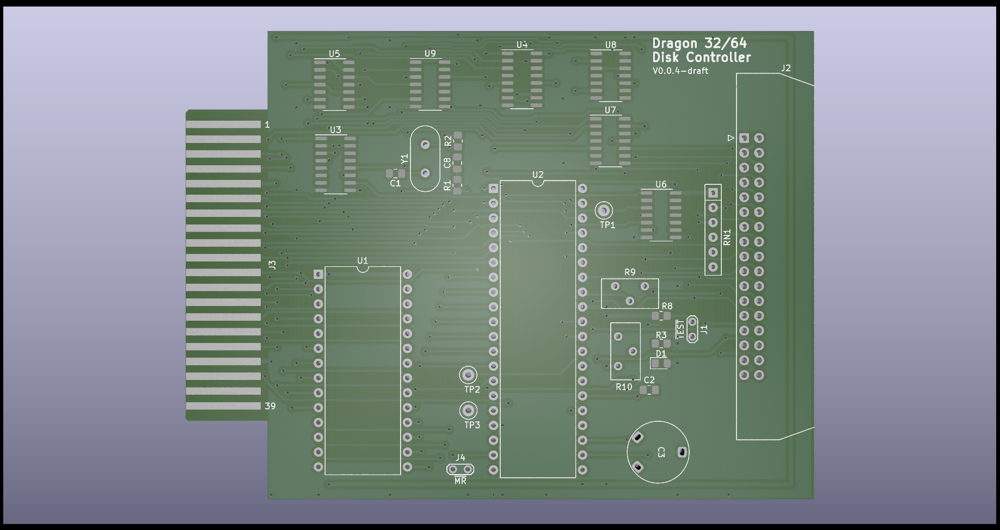

# Dragon 32/64 Disk Controller Card #

This project contains the design and build
documents for a recreation of the DragonDos
disc controller

## Design ##

The schematics use a WDC WD2797 disc controller
IC as the core of the board, this is consistent
with the original DragonData design. Other 
2797 ICs from different manufacturers should
still work

Other than the rom and controller the discrete
logic chips are surface mount to help with the
availability of components. In all cases the
surface mount parts are of the largest versions
available to try and make the assembly of the
board feasible for hand soldering

## Progress ##

In the current state the board is untested

The PCB layout is (very) generous on dimensions
and needs work to shrink it down. Iterating on
this won't change the functionality and should
significantly reduce the size of the board, and
hence the cost of fabrication

## Assembly and BoM ##

Until the board progresses to a point where it
can be tested the assembly instructions and the
proven bill of materials are left unpublished

## Calibration ##

1. Adjust the RPW timing - measure the pulse
width of the TG43 signal from pin 29 on U2. 
Use R10 to fix the pulse at 600ns

2. Adjust the WPW timing - measure the pulse
width of the signal from pin 3 of U6, pin 31 of U2,
or pin 22 of the IDC connector (the IDC pin is
inverted). Use R9 to fix the pulse at 300ns

3. Adjust VC0 timing - measure the frequency
of the DIRC signal from pin 1 of U6, pin 16 of U2,
or pin 18 of the IDC connector (the IDC pin is
inverted). Use C3 to set the signal at 250KHz

### Complete Adjustment Procedure ###

The official documentation identifies a more
complex and thorough adjustment procedure.
Where !TEST is referenced you can use the test
point on the board at J1. Pin 1 is connected to
!TEST on U2 (pin 22)

#### Write Precompensation ####

1. Set !TEST to high (1)
2. Strobe !MR on U2 Pin 19
3. Set !TEST to low (0)
4. Measure pulse width on U2 Pin 31
5. Adjust R9 until pulse width is 300ns
6. Set !TEST to high (1)

#### Data Separator ####

1. Set !Test to high (1)
2. Strobe !MR on U2 pin 19
3. Check that !5/8 and !DDEN are set properly. U2 pin 17 and 37
4. Set !TEST to low (0)
5. Measure pulse width on U2 Pin 29
6. Adjust R10 until pulse width is 600ns
7. Measure frequency on U2 pin 16
8. Adjust C3 until frequency is 250KHz
9. Set !TEST to high (1)